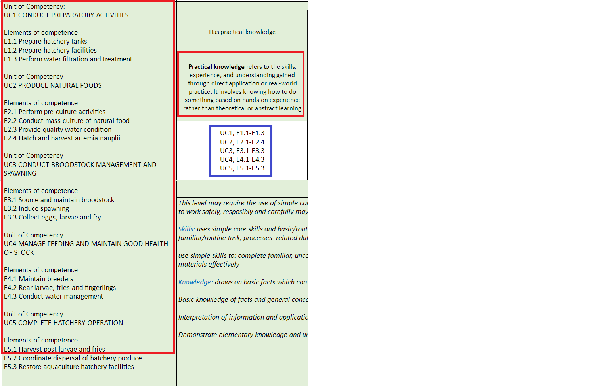
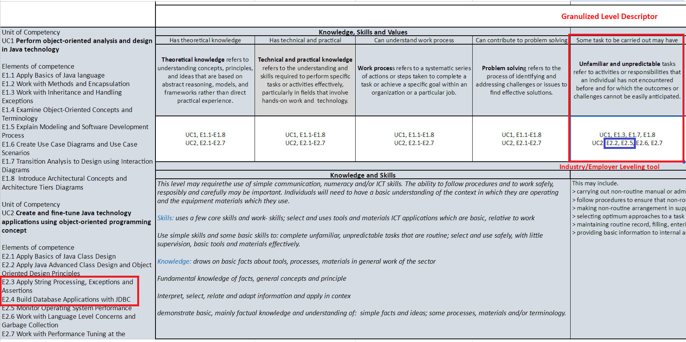

# gsheets_tool

A tool for integrating GenAI (Claude 3.5) with Google Sheets. This tool automates tasks that traditionally require significant time and effort from humans, making it easier to handle complex data processing without extensive programming knowledge.

## Problem Statement

The Level Alignment Matrix is used as a guideline to assess qualifications within the Philippine Qualifications Framework. The task involves matching elements of competence to the corresponding level indicators. Traditionally, this process can take multiple hours for a person to complete. However, using the LLM (Large Language Model), the entire spreadsheet can be processed in just a few minutes.

### Example Output

In the sample output, you can see how Claude identified that UC2 E2.3 and E2.4 are not applicable to the indicator.

- **E2.3**: Apply String Processing, Exceptions, and Assertions
- **E2.4**: Build Database Applications with JDBC  

**Indicator**: Unfamiliar and unpredictable tasks refer to activities or responsibilities that an individual has not encountered before, where the outcomes or challenges cannot be easily anticipated.

